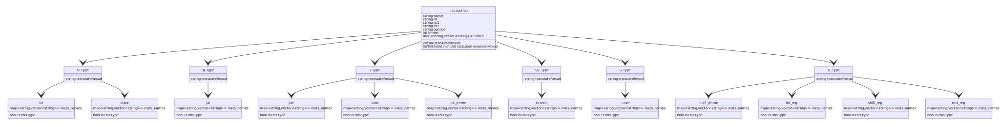

# RISC-V Assmebler

A program convert risc-v to machine code  

implement set :  
Set Name | description
-------- | -----------
RV32I    | without fench
RV32M    | 

## Build Instruction

require `gnu-gcc 4.3.5` or higher


```bash
g++ -Wall -std=c++14 -g main.cpp -o main
```

## Run Program
``` bash
./main [risc-v file]
```

## Program Explanation
#### Program Inheritance Graph


---
### General variable

variable    | type    | description
---       | ---     |  ---
*insts*    | map<string,vector<string>> | store instruction's information.<br> key is inst's name.
*insts[ins name]*    | vector<string> |  store Func3,Func2,Func5 in order.<br> is "" if empty.
*FUNC3* | int=0 | position in insts[ins name]
*FUNC2* | int=1 | position in insts[ins name]
*FUNC5* | int=2 | position in insts[ins name]

---

### Instruction

**Member**
Name    | type    | description
---       | ---     |  ---
*name*    | string  | Instruction name
*rd*      | string  | distanation register
*rs1*     | string  | source register 1
*rs2*     | string  | source register 2
*opcode*  | string  | this ins. group's opcode, set by child class
*imme*    | int     | any number
*insts*   | map<string,vector<string>>* | pointer to child class's insts, set by child class

**Member Function**
Name | arg  | return type
---        | ---        | ---        
*translateResult* | **None** |  string 
*intToBin* | **int** num,<br>**int** size,<br>**bool** reversed=true | string

#### translateResult  
* pure virtual function, *implenment by child class*
#### intToBin
* static function
* return <u>binary version</u> of num, which len is size

```
intToBin(12,4,true);
> "1100"
intToBin(12,4,false);
> "0011"
intToBin(-2,6,true);
> "111110"
```

---
### \{U | UJ | I | SB | S | R\} Type Instruction
Name | arg  | return type
---        | ---        | ---        
*translateReuslt* | None | string

#### translateResult
* Implenment at this class, convert instruction to machine code

---
### Instruction Group

Name    | type    | description
---       | ---     |  ---
insts_names | same as insts | const staic member

insts_names
* give instruction info (name,FUNC3,FUNC2,FUNC5)
* point parent class `Instruction`'s insts to this

Name | arg  | return type
---        | ---        | ---     
isThisType | string name | const bool

isThisType
* return if `name` instruction is this group

## Program Flow
1. Separate instruction info ( like rs1, rs2, rd...etc )
2. check if this line has label  
    2.1 if has label, save label into label map  
    > use label as key, tuple(start, end) as jumper and distination 
4. fetch all label in lable map, calculate diff between jumper and distination
5. find which instruction group this instruction belongs to
6. convert it into machine code